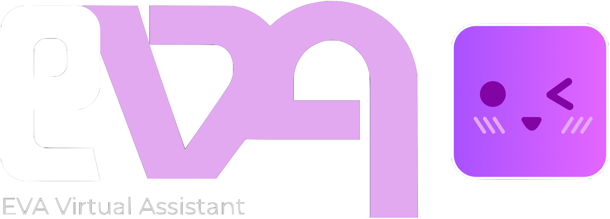

  

<h1 align="center">⚖️ EVA Virtual Assistant (ADVANCED)</h1>
Welcome to the EVA (Advanced) Virtual Assistant Project!

## Introduction
EVA is an advanced virtual assistant (as seen by the name) that allows the user to execute various tasks on their device with precision and power. It can handle complex tasks, queries and answer difficult questions, while being able to reason and talk with the user normally as if it was a friendly companion!

## How to use EVA?
Using EVA is pretty simple. Just follow the given instructions:

1. Download the source code onto your device and open it in any code editor (VS Code Recommended).
2. Open up a new terminal window and change directory into the project folder.
    - Create a new python virtual environment using `python3 -m venv .venv`
    - Activate your python venv by doing `source .venv/bin/activate`
    - It is a good practice to upgrade pip using `pip install --upgrade pip`
    - Install the requirements using `pip install -r requirements.txt`
3. Setup is almost complete! You will be needing a Piper model, which you can get here: [Download Piper Model](https://huggingface.co/rhasspy/piper-voices/tree/main) (make sure to download both the .onnx and the .onnx.json file for that model)
4. Place your .onnx and .onnx.json files inside the models/voice_models folder. Don't forget to change the path to your Piper model in `assets/system/config.yaml`.
5. Finally, you will be needing an Ollama model to run this. You can download Ollama at https://ollama.com/download.
    - OR, for macOS: `brew install ollama` and then `brew services start ollama`.
6. You can install the recommended Ollama model used here by doing `ollama pull qwen3:4b-q4_K_M`

And thats it! Just run the `main.py` file using `python -m main` and watch EVA run!
> NOTE: First few runs do tend to take some time. LLM will get faster as the model warms up. Same goes for Piper.
> It will take some time to install the faster-whisper model on the first run. Please be patient.

### Common Issues with EVA

> EVA Hangs on Listening...

Currently, this is a known bug on macOS, but a temporary fix is in place. If it still happens, you can do the following:  

To first exit the program, you must run the following commands in the terminal window:
1. Try doing `Ctrl+C`, if the program does not exit, do `Ctrl+Z` to suspend the program.
2. `ps aux | grep python` - this should display all running python processes.
    - Try to find a process that ends with `... -m main` or `... main`.
    - Copy the Porcess ID (will be a 4-5 digit number, eg. 5103) of the process.
3. `kill process-id` where you replace `process-id` with the ID you copied.

This should have successfully stopped your program. Next do the following to prevent this:
1. Open the `assets/system/config.yaml` file.
2. Go to `STREAM_LIFETIME` under `listener:` and change it from 4 to something lower. Try 3 or 2.

Now when you run the program, it should work just fine. Please raise an issue if this does now work.

---

> Assistant says they did an action, but no tool called.

Yes, sometimes the LLM does "forget" to actually call the tool, or it tries to call a tool that does not exist.  
We will be trying to improve LLM tool-calling in the future, so this currently has no real fix, apart from using a better Qwen3 model which you can install using `ollama pull qwen3` and then change the config to use it instead.

### More Information will be out soon!
Official Docs: https://eva-virtual-assistant.notion.site/EVA-AI-337d6094011980ec89fed83db235bb4c
> Happy coding! - LC